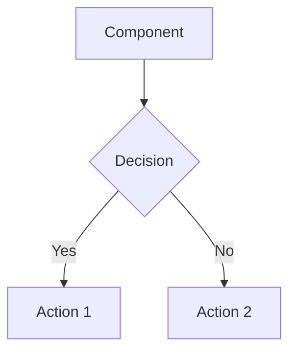
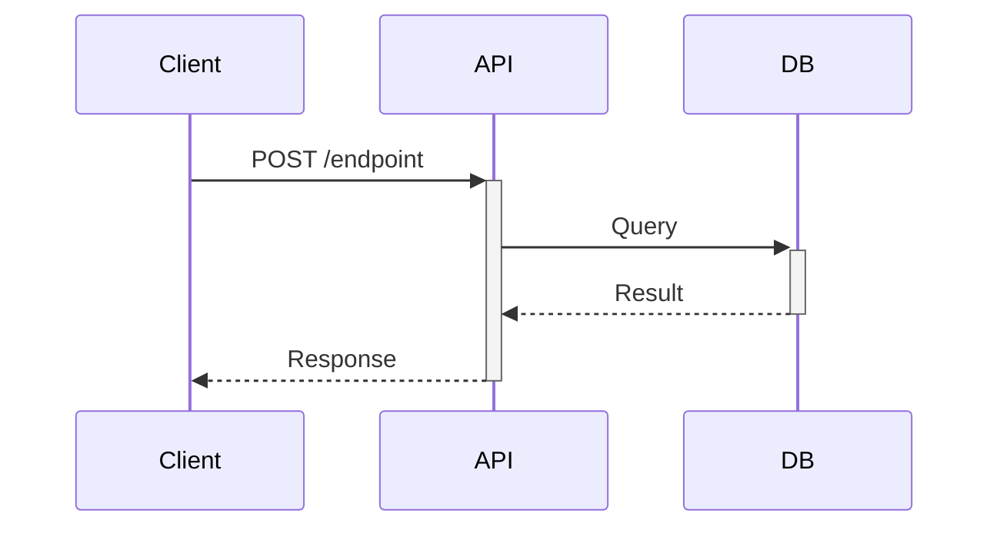
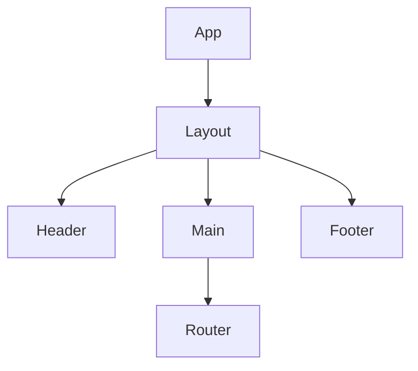
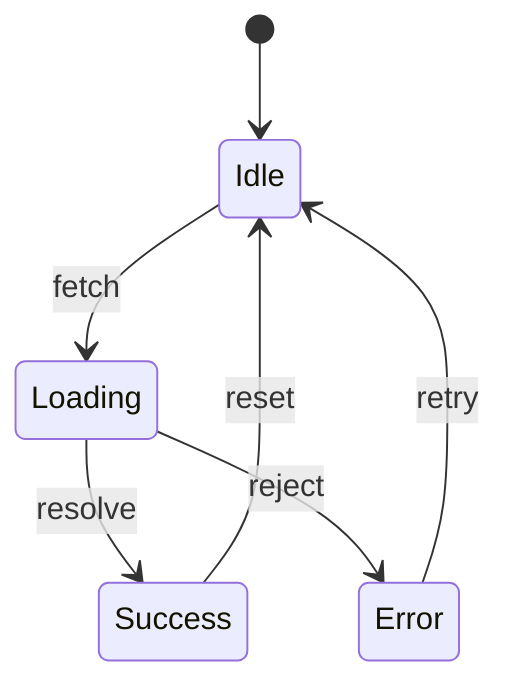

Generate a Mermaid diagram for "$ARGUMENTS".

## Process

1. **Analyze the codebase** to understand the flow/architecture
   - Find relevant files using grep/glob
   - Trace the data flow or component relationships
   - Identify key interfaces and dependencies

2. **Choose diagram type** based on subject:
   - `flowchart` - Process flows, decision trees
   - `sequenceDiagram` - API calls, async flows, request/response
   - `classDiagram` - Type relationships, interfaces
   - `erDiagram` - Data models, database schema
   - `stateDiagram-v2` - State machines, UI states

3. **Generate Mermaid diagram**



## Guidelines

- Keep diagrams focused - one concept per diagram
- Use clear, descriptive labels
- Show the happy path prominently
- Add notes for non-obvious connections
- Include file paths as comments for reference

## Output

Save to `.claude/diagrams/[subject].md`:

```markdown
# [Subject] Architecture

## Overview
[Brief description]

## Diagram
\`\`\`mermaid
[diagram code]
\`\`\`

## Key Files
- `path/to/file.ts` - description
- `path/to/other.ts` - description

## Notes
- [Any important decisions or trade-offs]
```

## Common Patterns

**API Flow:**


**Component Tree:**


**State Machine:**

